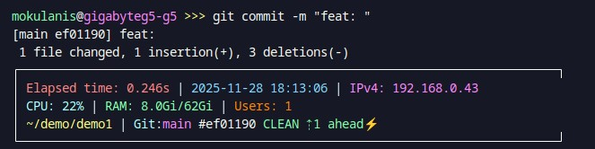
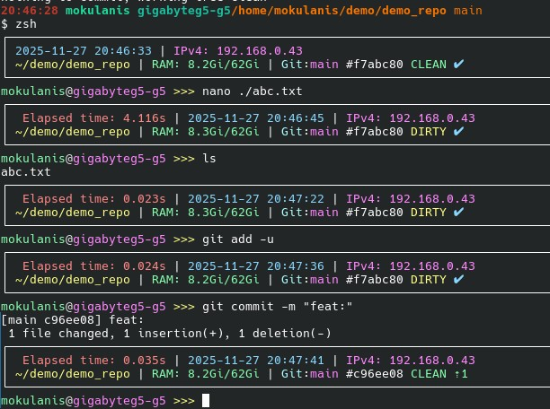
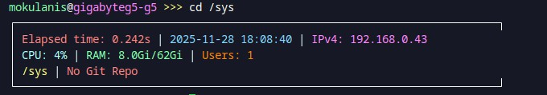
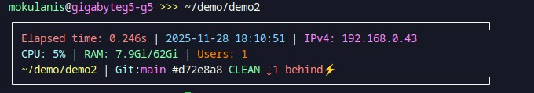

# 🎨 MTSH - Advanced Zsh Theme

[](https://www.gnu.org/licenses/gpl-3.0)
[](https://www.zsh.org/)
[](https://ohmyz.sh/)

A beautiful and feature-rich Zsh theme that provides comprehensive system and Git information in an elegant frame. Perfect for developers who want to stay informed about their environment at a glance.


## ✨ Features

### 📊 System Information
- **Date & Time** - Current date and time display
- **IP Address** - Your current IPv4 address
- **RAM Usage** - Memory consumption (used/total)
- **Command Timing** - Execution time for the last command



### 🔧 Git Integration
- **Branch Information** - Current branch name and commit hash
- **Working Directory Status** - Clean/Dirty state with color coding
- **Sync Status** - Behind/ahead status with remote repository
- **Smart Fetch Detection** - Indicates when remote info might be outdated (⚡)
- **Fetch Needed Indicator** - Shows ⚡ when local remote refs are older than 5 minutes
- 




### 🎯 Smart Features
- **Path Shortening** - Long paths are intelligently abbreviated
- **Dark Theme Optimized** - Colors designed for dark backgrounds
- **70-Character Frame** - Clean, consistent visual layout
- **Real-time Updates** - Information updates with each command

### 💡 Why I Created This Theme

As a DevOps engineer and low-level programmer working with multiple repositories across different machines as an administrator, I needed a theme that gives me instant visibility into:
- **System status** (RAM, IP, timing) for server management
- **Git synchronization** across multiple repos without constant `git fetch`
- **Clean visual layout** that works in various terminal environments
- **Performance** - no slow operations that delay the prompt

This theme was born from daily frustration of switching between repos and losing track of sync status, system resources, and execution times. It's designed for developers and sysadmins who juggle multiple projects simultaneously.

*Built in the spirit of GNU - free software that empowers users. If you have suggestions or improvements, please share them with the community!*

## 🚀 Installation

### Prerequisites
- [Zsh](https://www.zsh.org/) (5.0+)
- [Oh My Zsh](https://ohmyz.sh/)

### Quick Install
```bash
# Clone the repository
git clone https://github.com/FPGArtktic/ohmyzsh-mtsh-theme.git

# Copy theme to Oh My Zsh custom themes directory
cp mtsh-theme/mtsh.zsh-theme ~/.oh-my-zsh/custom/themes/

# Set the theme in your .zshrc file
sed -i 's/ZSH_THEME=".*"/ZSH_THEME="mtsh"/' ~/.zshrc

# Reload your terminal
source ~/.zshrc
```

### Manual Installation
1. Download `mtsh.zsh-theme`
2. Copy it to `~/.oh-my-zsh/custom/themes/`
3. Edit `~/.zshrc` and set: `ZSH_THEME="mtsh"`
4. Restart your terminal or run `source ~/.zshrc`

## 🎨 Color Scheme

The theme uses a carefully selected 256-color palette optimized for dark backgrounds:

| Element | Color | Description |
|---------|-------|-------------|
| Date/Time | Bright Blue (`117`) | Easy to read timestamp |
| Directory | Bright Yellow (`228`) | Current working directory |
| Git Branch | Bright Magenta (`213`) | Git branch name |
| Git Clean | Bright Green (`121`) | Clean repository state |
| Git Dirty | Bright Red (`210`) | Modified files indicator |
| Git Behind | Red (`210`) | Behind remote commits |
| Git Ahead | Green (`121`) | Ahead of remote commits |
| IP Address | Bright Magenta (`213`) | Network information |
| RAM Usage | Bright Green (`121`) | System memory |

## 📸 Theme Examples

### Clean Repository (Synced)


### Dirty Repository (Behind Remote)


### Long Path Shortened


### Command Timing Display


## 🔧 Git Status Indicators

| Symbol | Meaning |
|--------|---------|
| `CLEAN` | No uncommitted changes |
| `DIRTY` | Uncommitted changes present |
| `✔ synced` | Up to date with remote |
| `⇡3 ahead` | 3 commits ahead of remote |
| `⇣2 behind` | 2 commits behind remote |
| `⇣1 ⇡2` | Behind and ahead (diverged) |
| `⚠ no remote` | No remote branch configured |
| `⚡` | Remote info may be outdated (>5min) - run `git fetch` |

## ⚙️ Configuration

The theme works out of the box, but you can customize colors by editing the theme file:

```bash
# Edit the theme file
nano ~/.oh-my-zsh/custom/themes/mtsh.zsh-theme

# Modify color variables at the top of precmd_mtsh() function
local C_BLUE='%F{117}'      # Change to your preferred blue
local C_MAGENTA='%F{213}'   # Change to your preferred magenta
# ... etc
```

## 🤝 Contributing

Contributions are welcome! Please feel free to submit a Pull Request. For major changes, please open an issue first to discuss what you would like to change.

1. Fork the repository
2. Create your feature branch (`git checkout -b feature/AmazingFeature`)
3. Commit your changes (`git commit -m 'Add some AmazingFeature'`)
4. Push to the branch (`git push origin feature/AmazingFeature`)
5. Open a Pull Request

## 📝 License

This project is licensed under the GNU General Public License v3.0 - see the [LICENSE](LICENSE) file for details.

## 👨‍💻 Author

**Mateusz Okulanis** - *FPGArtktic@outlook.com*

## 🙏 Acknowledgments

- Inspired by various Zsh themes in the community
- Built for developers who love detailed, informative prompts
- Optimized for modern terminal emulators with 256-color support

---

⭐ **Star this repo if you find it useful!** ⭐